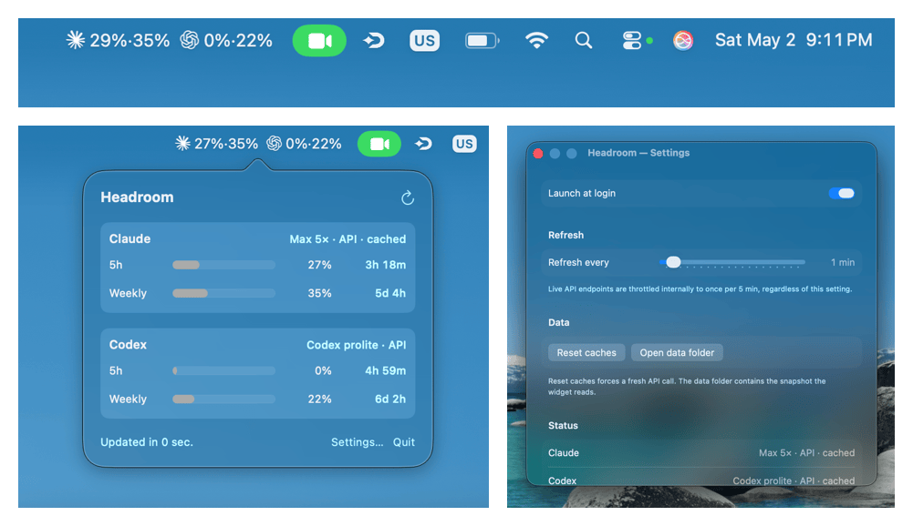

# Headroom — macOS menu-bar app + widget for Claude Code, Codex CLI & Cursor

Shows your remaining rate-limit headroom for Claude Code, Codex CLI, and Cursor
directly in the macOS menu bar, with a matching desktop widget.

## Screenshots

The menu-bar readout pairs each provider's logo with `5h·weekly` percentages.
Click it for the popover; open Settings from there.

<p align="center">
  
</p>

A WidgetKit extension is bundled too — small and medium desktop widgets that
show the same data — but it's only visible after macOS finishes indexing a
signed build of the app (see TESTING.md).

## Data sources (no scraping, no extra config)

- **Codex** — calls `GET https://chatgpt.com/backend-api/wham/usage` with the
  OAuth bearer + `ChatGPT-Account-Id` headers from `~/.codex/auth.json`. This
  is the same endpoint the Codex TUI hits on launch. If the auth file includes
  a refresh token, Headroom refreshes stale access tokens and writes the updated
  token back to that file. Throttled to once every 5 min and disk-cached. Falls
  back to parsing the `rate_limits` snapshots Codex sessions persist to
  `~/.codex/sessions/YYYY/MM/DD/rollout-*.jsonl` if the API is unreachable.
- **Claude** — calls `GET /api/oauth/usage` with the OAuth token Claude Code
  stores in `~/.claude/.credentials.json` or in your macOS keychain (service:
  `Claude Code-credentials`). After a successful keychain read, Headroom caches
  the credential in its own keychain item so timer refreshes don't repeatedly
  ask macOS for Claude Code keychain access. This is the same endpoint the
  `/usage` slash command uses internally. Throttled to one request per 5 min
  and cached to disk so a 429 doesn't blank the widget.
- **Cursor** — calls `POST api2.cursor.sh/aiserver.v1.DashboardService/GetCurrentPeriodUsage`
  with the OAuth bearer Cursor stores in
  `~/Library/Application Support/Cursor/User/globalStorage/state.vscdb`
  (key `cursorAuth/accessToken`). Falls back to `GET api2.cursor.sh/auth/usage`
  for enterprise request-based plans. If the token is expired and a refresh token
  is present, Headroom refreshes via `POST api2.cursor.sh/oauth/token` and writes
  the updated token back to the same SQLite store. Throttled to once every 5 min
  and disk-cached. Shows Auto + API usage percentages for the current billing cycle.

If the OAuth call fails persistently and there's no cached response, falls back
to a local-jsonl token estimator using your detected plan tier
(`rateLimitTier` in the credential blob — `default_claude_pro`,
`default_claude_max_5x`, etc.). The estimator is rough; the API is the truth.

## Build

Requires Xcode 15+ and macOS 14+.

```sh
brew install xcodegen        # one-time
xcodegen generate            # creates Headroom.xcodeproj
open Headroom.xcodeproj   # then ⌘R
```

After first run, add the widget from System Settings ▸ Wallpaper / Notification
Center, or from the desktop right-click ▸ Edit Widgets.

## CLI

The `headroom` SwiftPM executable prints the same numbers without launching
the GUI — handy for scripting:

```sh
cd HeadroomKit
swift run headroom          # human-readable
swift run headroom --json   # machine-readable
```

Sample human output:

```
Claude
  Max 5× · API
  5h     54.0%  resets in 1h53m
  weekly 32.0%  resets in 128h53m

Codex
  codex API
  5h      4.0%  resets in 1h09m
  weekly 19.0%  resets in 151h44m

Cursor
  Ultra · API
  Auto     12.5%  resets in 128h53m
  API      46.4%  resets in 128h53m
```

## Project layout

```
Headroom.xcodeproj                # generated by xcodegen
HeadroomKit/                      # SwiftPM library + CLI
  Sources/HeadroomKit/
    Models/UsageState.swift
    Models/PlanLimits.swift
    Readers/CodexUsageReader.swift   # parses ~/.codex/sessions/**/*.jsonl
    Readers/ClaudeUsageReader.swift  # local-jsonl estimator (fallback)
    Readers/KeychainCredentials.swift
    Readers/CursorCredentials.swift  # reads Cursor IDE SQLite auth
    Network/OAuthUsageClient.swift   # /api/oauth/usage
    Network/CursorUsageClient.swift  # GetCurrentPeriodUsage
    Refresher.swift                  # ties API + cache + fallback together
  Sources/headroom/              # CLI executable
HeadroomApp/                      # menu-bar host app
  HeadroomApp.swift
  AppDelegate.swift                  # NSStatusItem + popover wiring
  RefreshController.swift            # timer + state.json writer
  PopoverView.swift
  SettingsView.swift
HeadroomWidget/                   # WidgetKit extension
  HeadroomWidget.swift            # @main bundle + TimelineProvider
  HeadroomWidgetView.swift        # small + medium layouts
project.yml                          # xcodegen spec
```

The host writes a snapshot to `~/Library/Application Support/Headroom/state.json`
on every refresh; the widget extension's `TimelineProvider` reads from the same
path. Both targets are unsandboxed for local dev, which avoids the App Group
entitlement (which requires a paid signing identity).

## Notes / limitations

- **Ad-hoc signed.** Build & run on your own machine works; redistribution would
  need a real signing identity and proper App Group entitlement.
- **Plan tier auto-detected.** If you switch plans, restart the app so it
  re-reads the keychain credential.
- **`/api/oauth/usage` is rate-limited.** The 5-min throttle keeps us well under
  the threshold, but if you bounce the app many times in a row you may see
  cached/stale numbers for a while.
